	System Description
In this section, the system will be described. The Micro-robots are moving on the coplanar coils which are actuated by magnetic field. As any motion problems the Newton’s second law was used to move Micro-robots. The equations are as follow: 
Ldi/dt= -Ri+u
v=  ds/dt         ,     a=  dv/dt    ,   and        F=f(i)
F=ma 

Where L is inductance, R is resistant, u is voltage. m refers to mass, a stands as the accelerator, and v is the derivative of position and F is total force. f(i) stands as the force as a function of current. 

i(t+1)= ∆t*((-R)/L i_1 (t)+ 1/L  u(t))+i(t)

Micro-robots will move forward by applying current in each coils and measuring forces. The Newton’s second law was used to measure the position of Micro-robots and from the equation (2) the final equation was achieved. 

mx ̈=F(x)*  (i(t))/0.1 

The Rung-Kuta method was used to solve this ode problem. 

x_1 (t+1)= ∆t*(x_2 )+ x_1 (t)
x_2 (t+1)=∆t*(1/m* F(x)* i(t)/0.1)+x_2 (t)

# Position
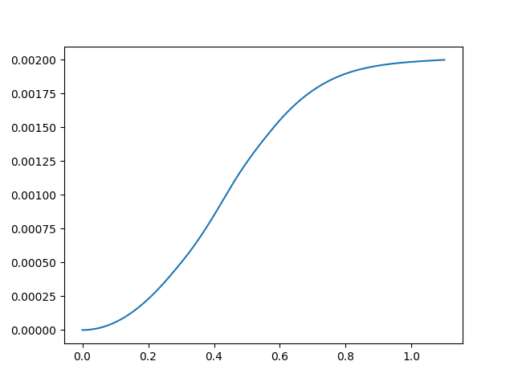

# Force
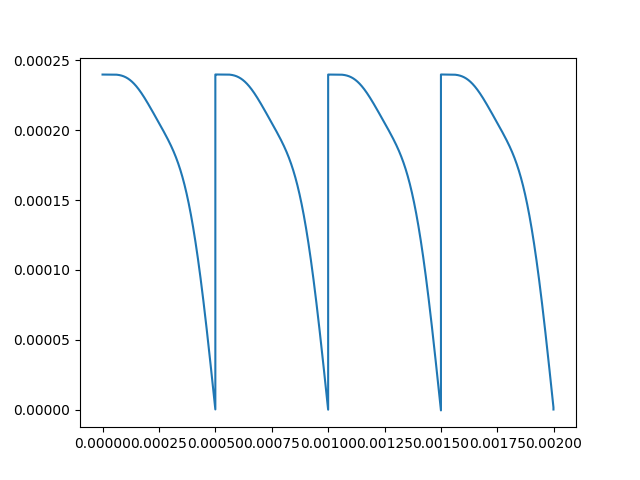

# Current
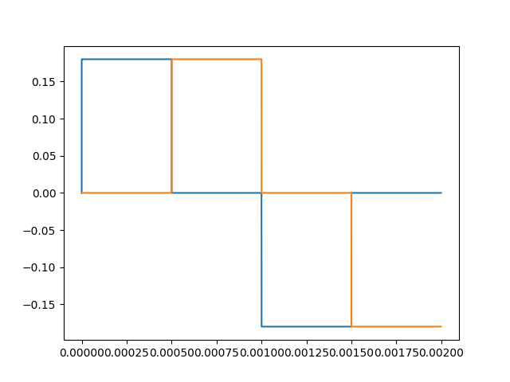

# Velocity
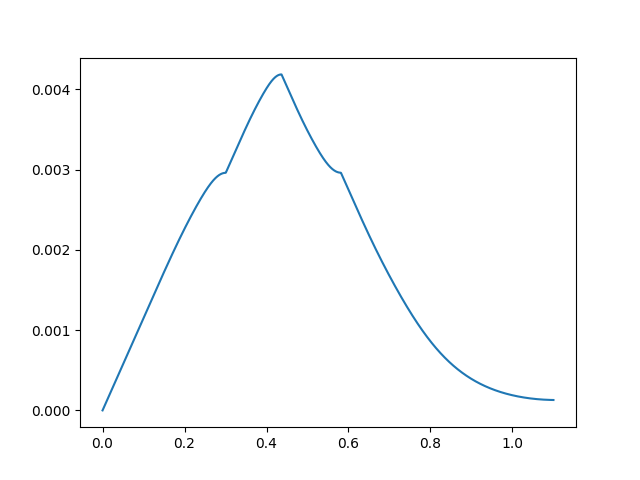


# Packing all the data as a dataframe
Use Pandas to create a dataframe
Pandas is a Python library with many helpful utilities for loading and working with structured data. You will use Pandas to download the dataset from a URL, and load it into a dataframe.

data are packed in the below form

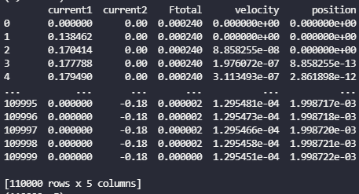

Split the dataframe into train, validation, and test
The dataset you downloaded was a single CSV file. You will split this into train, validation, and test sets.

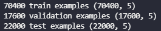
# Create an input pipeline using tf.data
Next, you will wrap the dataframes with tf.data, in order to shuffle and batch the data. If you were working with a very large CSV file (so large that it does not fit into memory), you would use tf.data to read it from disk directly.

Now that you have created the input pipeline.
```
batch_size = 32
train_ds = dataframe_to_dataset(train, batch_size=batch_size)
val_ds = dataframe_to_dataset(val, shuffle=False, batch_size=batch_size)
test_ds = dataframe_to_dataset(test, shuffle=False, batch_size=batch_size)
```
# Demonstrate the use of preprocessing layers.
The Keras preprocessing layers API allows you to build Keras-native input processing pipelines. You will use 3 preprocessing layers to demonstrate the feature preprocessing code.

Normalization - Feature-wise normalization of the data.
CategoryEncoding - Category encoding layer.
StringLookup - Maps strings from a vocabulary to integer indices.
IntegerLookup - Maps integers from a vocabulary to integer indices.
You can find a list of available preprocessing layers here.

Numeric columns
For each of the Numeric feature, you will use a Normalization() layer to make sure the mean of each feature is 0 and its standard deviation is 1.

get_normalization_layer function returns a layer which applies featurewise normalization to numerical features.

# Choose which columns to use
You have seen how to use several types of preprocessing layers. Now you will use them to train a model. You will be using Keras-functional API to build the model. The Keras functional API is a way to create models that are more flexible than the tf.keras.Sequential API.
```
for header in ['current1','current2','Ftotal','velocity']:
  numeric_col = tf.keras.Input(shape=(1,), name=header)
  normalization_layer = get_normalization_layer(header, train_ds)
  encoded_numeric_col = normalization_layer(numeric_col)
  all_inputs.append(numeric_col)
  encoded_features.append(encoded_numeric_col)
```

# Create, compile, and train the model
Now you can create our end-to-end model.
```
all_features = tf.keras.layers.concatenate(encoded_features)
x = tf.keras.layers.Dense(32, activation="relu")(all_features)
x = tf.keras.layers.Dropout(0.5)(x)
output = tf.keras.layers.Dense(1)(x)
model = tf.keras.Model(all_inputs, output)
model.compile(optimizer='adam',
              loss=tf.keras.losses.MeanSquaredError(),
              metrics=["accuracy"])
# Train the model
model_info = model.fit(train_ds, epochs=MAX_EPOCHS, validation_data=val_ds)
```
If we visualize the our connectivity graph, we will get bellow figure.

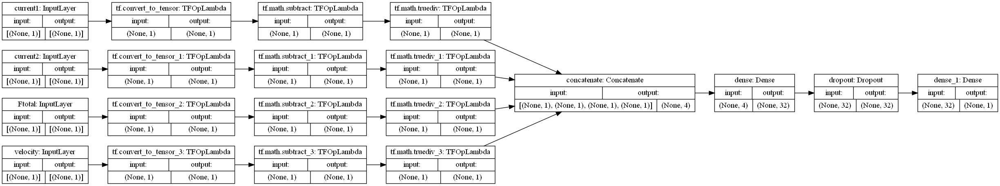

after training for about 10 epochs we get this figure.
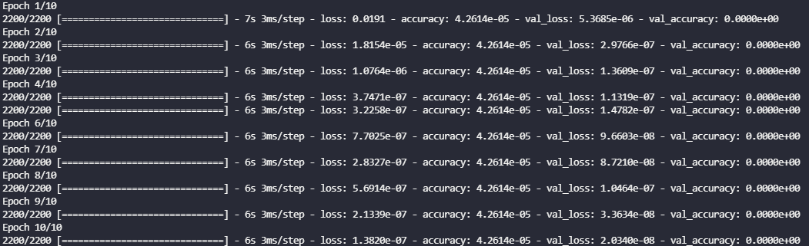

# Summary of the Model
and the summary of the model is as bellow: 

Model: "model"
___________________________________________________________________________________
Layer (type)                    Output Shape         Param #     Connected to                     
==================================================================================================
current1 (InputLayer)           [(None, 1)]          0                                            
__________________________________________________________________________________________________
current2 (InputLayer)           [(None, 1)]          0                                            
__________________________________________________________________________________________________
Ftotal (InputLayer)             [(None, 1)]          0                                            
__________________________________________________________________________________________________
velocity (InputLayer)           [(None, 1)]          0                                            
__________________________________________________________________________________________________
tf.convert_to_tensor (TFOpLambd (None, 1)            0           current1[0][0]                   
__________________________________________________________________________________________________
tf.convert_to_tensor_1 (TFOpLam (None, 1)            0           current2[0][0]                   
__________________________________________________________________________________________________
tf.convert_to_tensor_2 (TFOpLam (None, 1)            0           Ftotal[0][0]                     
__________________________________________________________________________________________________
tf.convert_to_tensor_3 (TFOpLam (None, 1)            0           velocity[0][0]                   
__________________________________________________________________________________________________
tf.math.subtract (TFOpLambda)   (None, 1)            0           tf.convert_to_tensor[0][0]       
__________________________________________________________________________________________________
tf.math.subtract_1 (TFOpLambda) (None, 1)            0           tf.convert_to_tensor_1[0][0]     
__________________________________________________________________________________________________
tf.math.subtract_2 (TFOpLambda) (None, 1)            0           tf.convert_to_tensor_2[0][0]     
__________________________________________________________________________________________________
tf.math.subtract_3 (TFOpLambda) (None, 1)            0           tf.convert_to_tensor_3[0][0]     
__________________________________________________________________________________________________
tf.math.truediv (TFOpLambda)    (None, 1)            0           tf.math.subtract[0][0]           
__________________________________________________________________________________________________
tf.math.truediv_1 (TFOpLambda)  (None, 1)            0           tf.math.subtract_1[0][0]         
__________________________________________________________________________________________________
tf.math.truediv_2 (TFOpLambda)  (None, 1)            0           tf.math.subtract_2[0][0]         
__________________________________________________________________________________________________
tf.math.truediv_3 (TFOpLambda)  (None, 1)            0           tf.math.subtract_3[0][0]         
__________________________________________________________________________________________________
concatenate (Concatenate)       (None, 4)            0           tf.math.truediv[0][0]            
                                                                 tf.math.truediv_1[0][0]          
                                                                 tf.math.truediv_2[0][0]          
                                                                 tf.math.truediv_3[0][0]          
________________________________________________________________________________________________
dense (Dense)                   (None, 32)           160         concatenate[0][0]                
__________________________________________________________________________________________________
dropout (Dropout)               (None, 32)           0           dense[0][0]                      
__________________________________________________________________________________________________
dense_1 (Dense)                 (None, 1)            33          dropout[0][0]                    
==================================================================================================
Total params: 193
Trainable params: 193
Non-trainable params: 0
__________________________________________________________________________________________________

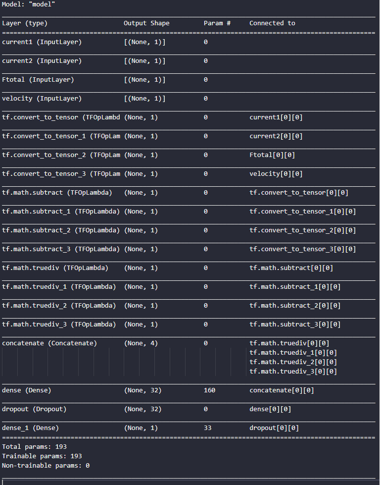
# visualize the Accuracy and loss and MSE
if we plot the accuracy and loss and MSE for the model, we will get following figures, which are indicates the model is not properly work. :) 

Accuracy
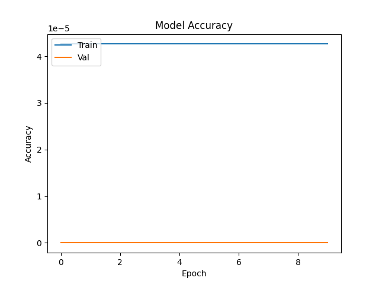

Loss
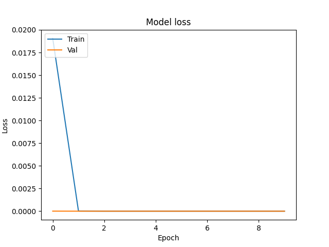

MSE
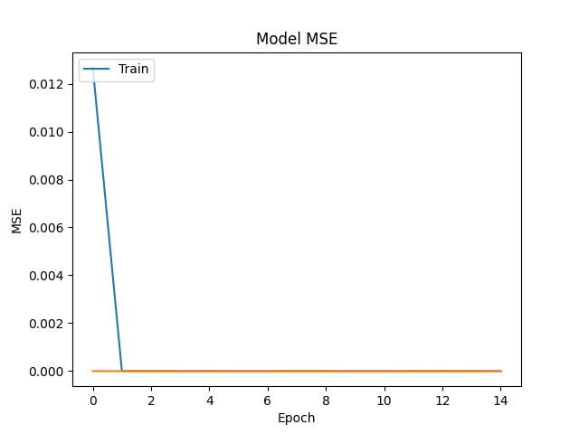